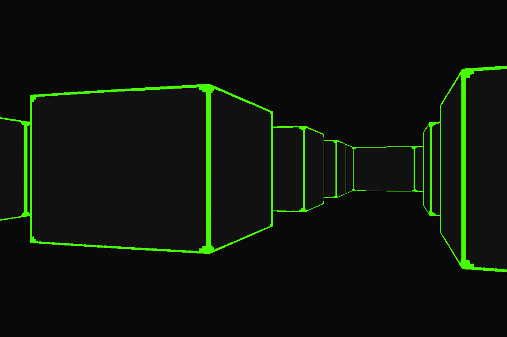
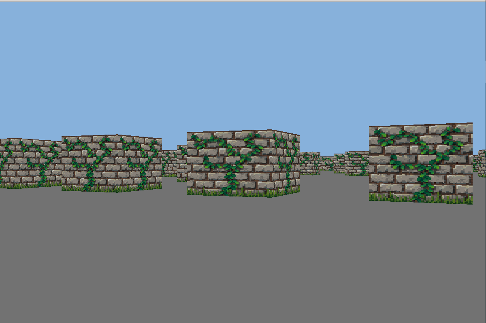
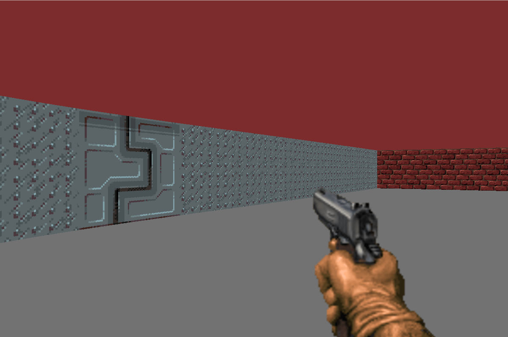

cub3D is a graphics project inspired by the classic game Wolfenstein 3D, the first true First Person Shooter game developed by Id Software. This project aims to provide a dynamic 3D view inside a maze using ray-casting techniques, allowing users to explore and navigate through it.

